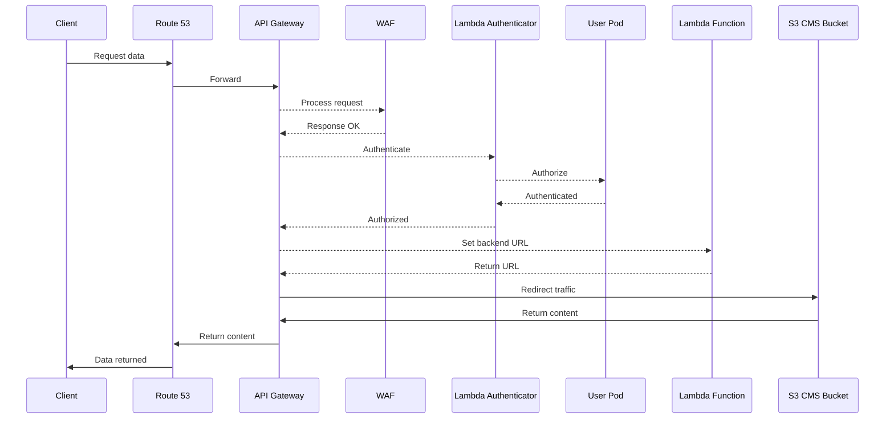
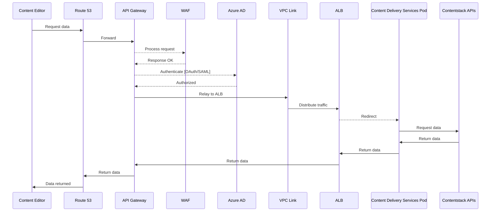
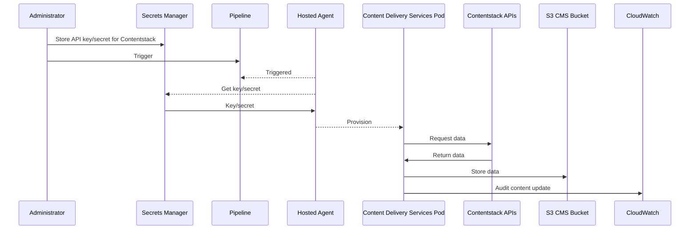

# Flows

Internet Clients to CMS Content

Describes the "happy flow" of communication.

```mermaid
sequenceDiagram
    Client->>Route 53: Request data
    Route 53->>API Gateway: Forward
    API Gateway -->> WAF: Process request
    WAF -->> API Gateway: Response OK
    API Gateway -->> Lambda Authenticator: Authenticate
    Lambda Authenticator -->> User Pod: Authorize
    User Pod -->> Lambda Authenticator: Authenticated
    Lambda Authenticator -->> API Gateway: Authorized
    API Gateway -->> Lambda Function: Set backend URL
    Lambda Function -->> API Gateway: Return URL
    API Gateway ->> S3 CMS Bucket: Redirect traffic
    S3 CMS Bucket ->> API Gateway: Return content
    API Gateway ->> Route 53: Return content
    Route 53 ->> Client: Data returned
```

Content preview

```mermaid
sequenceDiagram
    Content Editor->>Route 53: Request data
    Route 53->>API Gateway: Forward
    API Gateway -->> WAF: Process request
    WAF -->> API Gateway: Response OK
    API Gateway -->> Azure AD: Authenticate [OAuth/SAML]
    Azure AD-->> API Gateway: Authorized
    API Gateway ->> VPC Link: Relay to ALB
    VPC Link ->> ALB: Distribute traffic
    ALB -->> Content Delivery Services Pod: Redirect
    Content Delivery Services Pod ->> Contentstack APIs: Request data
    Contentstack APIs ->> Content Delivery Services Pod: Return data
    Content Delivery Services Pod ->> ALB: Return data
    ALB ->> API Gateway: Return data
    API Gateway ->> Route 53: Return data
    Route 53 ->> Content Editor: Data returned
```

Content publish

```mermaid
sequenceDiagram
    Administrator ->>Secrets Manager: Store API key/secret for Contentstack
    Administrator ->>Pipeline: Trigger
    Hosted Agent -->> Pipeline: Triggered
    Hosted Agent -->> Secrets Manager: Get key/secret
    Secrets Manager ->> Hosted Agent: Key/secret
    Hosted Agent -->> Content Delivery Services Pod: Provision
    Content Delivery Services Pod ->> Contentstack APIs: Request data
    Contentstack APIs ->> Content Delivery Services Pod: Return data
    Content Delivery Services Pod ->> S3 CMS Bucket: Store data
    Content Delivery Services Pod ->> CloudWatch: Audit content update
```
